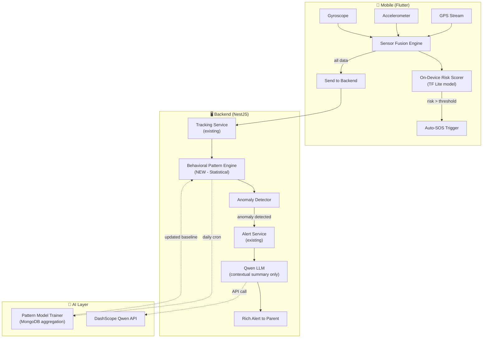

# SafeTrack AI — Predictive Safety Intelligence Implementation Plan

## Executive Summary

This plan integrates AI-powered predictive safety intelligence into the existing SafeTrack platform across **4 pillars**: Behavioral Pattern Intelligence, Contextual Digital Monitoring, Contextual SOS/Panic AI, and Emergency Response Protocol.

> [!IMPORTANT]
> **Critical Architecture Decision**: The product brief proposes using an LLM for everything, but **that's NOT the best practice** for most of these features. Below I recommend a **hybrid approach** — using the right tool for each job — with Qwen LLM reserved for where it genuinely adds value (contextual alert summarization, natural language reports).

---

## What Already Exists vs What's New

### ✅ Already Built (Your Current Codebase)
| Feature | Location |
|---------|----------|
| Real-time GPS tracking + Redis cache | [tracking.service.ts](file:///c:/Users/ACER/Documents/STAGE-SAFE/SafeTrack-backend/src/modules/tracking/tracking.service.ts) |
| Speed alerts, crash detection, hard braking | [tracking.service.ts#L663-L719](file:///c:/Users/ACER/Documents/STAGE-SAFE/SafeTrack-backend/src/modules/tracking/tracking.service.ts#L663-L719) |
| Geofence enter/exit detection | [geofences.service.ts](file:///c:/Users/ACER/Documents/STAGE-SAFE/SafeTrack-backend/src/modules/geofences/geofences.service.ts) |
| Unknown zone detection | [geofences.service.ts#L312-L325](file:///c:/Users/ACER/Documents/STAGE-SAFE/SafeTrack-backend/src/modules/geofences/geofences.service.ts#L312-L325) |
| Out-of-hours movement alerts | [tracking.service.ts#L128-L143](file:///c:/Users/ACER/Documents/STAGE-SAFE/SafeTrack-backend/src/modules/tracking/tracking.service.ts#L128-L143) |
| Battery low, device offline alerts | [tracking.service.ts#L209-L296](file:///c:/Users/ACER/Documents/STAGE-SAFE/SafeTrack-backend/src/modules/tracking/tracking.service.ts#L209-L296) |
| Manual SOS trigger + check-in timer | [sos.service.ts](file:///c:/Users/ACER/Documents/STAGE-SAFE/SafeTrack-backend/src/modules/sos/sos.service.ts) |
| Multi-recipient alert dispatch (WS + Push) | [alerts.service.ts](file:///c:/Users/ACER/Documents/STAGE-SAFE/SafeTrack-backend/src/modules/alerts/alerts.service.ts) |
| Accelerometer crash detection (mobile) | [event_dispatcher_service.dart#L164-L186](file:///c:/Users/ACER/Documents/STAGE-SAFE/SafeTrack-mobile/lib/services/event_dispatcher_service.dart#L164-L186) |
| Volume-button SOS trigger | [SosVolumeListenerService.kt](file:///c:/Users/ACER/Documents/STAGE-SAFE/SafeTrack-mobile/android/app/src/main/kotlin/com/example/safetrack_app/SosVolumeListenerService.kt) |
| Activity classification (still/walking/running/vehicle) | [device_monitoring_service.dart](file:///c:/Users/ACER/Documents/STAGE-SAFE/SafeTrack-mobile/lib/services/device_monitoring_service.dart) |
| Location history, trajectory, heatmaps | [history.service.ts](file:///c:/Users/ACER/Documents/STAGE-SAFE/SafeTrack-backend/src/modules/history/history.service.ts) / [trajectory.service.ts](file:///c:/Users/ACER/Documents/STAGE-SAFE/SafeTrack-backend/src/modules/trajectory/trajectory.service.ts) |

### 🆕 What Needs to Be Built
| Feature | Approach |
|---------|----------|
| **Behavioral Pattern Learning** | Statistical model (not LLM) — learns daily routines from location history |
| **Route Deviation Detection** | Geo-statistical algorithm comparing live path to learned baselines |
| **Dwell Time Anomaly** | Time-at-location analysis against baseline patterns |
| **Contextual Digital Monitoring** | NOT recommended for MVP — requires deep OS integration, privacy concerns |
| **Autonomous SOS (Contextual Panic AI)** | On-device sensor fusion (TF Lite) + enhanced backend signal analysis |
| **AI-Powered Alert Summarization** | **Qwen LLM** — generates contextual, natural-language incident summaries |
| **Emergency Response Protocol** | Enhance existing SOS with automated multi-channel escalation |

---

## 🧠 Better Architecture Recommendations

> [!WARNING]
> The product brief suggests running all AI through an LLM. This is **problematic** for several reasons:
> 1. **Latency**: LLM API calls take 1-3 seconds — unacceptable for real-time safety decisions
> 2. **Cost**: Every location update calling Qwen = massive API costs at scale
> 3. **Reliability**: Safety features MUST NOT depend on a third-party API being available
> 4. **Privacy**: Sending child location data to external LLM services raises GDPR/privacy concerns

### Recommended Hybrid Architecture



| Feature | Tool | Why |
|---------|------|-----|
| Behavioral patterns | **Statistical model** (MongoDB aggregation + simple math) | Fast, no API dependency, works offline |
| Route deviation | **Haversine + corridor matching** (you already have haversine) | Sub-millisecond computation |
| Dwell time anomaly | **Time-series analysis** (simple moving averages) | No LLM needed for "is this duration unusual?" |
| Crash/fall detection | **On-device TensorFlow Lite** | Must work without network, <10ms response |
| Alert summarization | **Qwen LLM** ✅ | Perfect use case — generates readable, contextual reports |
| Daily safety report | **Qwen LLM** ✅ | Summarize a day's events into natural language |
| Incident analysis | **Qwen LLM** ✅ | Post-event analysis and recommendations |

---

## User Review Required

> [!IMPORTANT]
> **Contextual Digital Monitoring (Pillar 2)** — The product brief describes monitoring chat messages, detecting cyberbullying, predatory language, etc. This feature:
> - Requires deep OS-level access (Accessibility Service on Android, MDM on iOS)
> - Has severe privacy implications (even with "no content logging")
> - Is blocked by platform policies (Google Play, Apple App Store)
> - Would require a separate, dedicated app with parental consent flows
>
> **Recommendation**: Defer this to a future phase or implement only as an opt-in browser extension. It is NOT feasible as a mobile feature in the current architecture.

> [!IMPORTANT]  
> **Qwen API Key**: You'll need a DashScope API key from [Alibaba Cloud Model Studio](https://modelstudio.console.alibabacloud.com/). The API is OpenAI-compatible, so we'll use the `openai` npm package pointed at DashScope's endpoint.

> [!WARNING]
> **Voice Analysis for Panic Detection** — Recording and analyzing a child's voice continuously raises major privacy and legal concerns. The on-device sensor approach (accelerometer + gyroscope + GPS speed) provides equivalent detection without microphone access.

---

## Open Questions

1. **Which Qwen model?** `qwen-plus` (cheaper, faster) or `qwen-max` (better quality)? For alert summarization, `qwen-plus` should suffice.
2. **DashScope region?** Singapore (`dashscope-intl`) or another region? This affects the API endpoint.
3. **Learning period**: How many days of data should the system collect before behavioral baselines become active? I suggest **7 days minimum**.
4. **Alert language**: Should AI-generated summaries be in French, English, or auto-detect based on user locale?
5. **Do you want the Contextual Digital Monitoring pillar at all for this phase?** I recommend deferring it.

---

## Proposed Changes

### Phase 1: AI Infrastructure & Qwen Integration

---

#### [NEW] `src/modules/ai/ai.module.ts`
New NestJS module that centralizes all AI/LLM functionality.

#### [NEW] `src/modules/ai/ai.service.ts`
Core AI service that:
- Connects to Qwen via DashScope API (OpenAI-compatible SDK)
- Provides `summarizeAlert()` — generates contextual natural-language alert descriptions
- Provides `generateDailyReport()` — creates daily safety summaries
- Provides `analyzeIncident()` — post-event AI analysis
- Handles API errors gracefully (fallback to template-based messages)
- Implements request caching to avoid duplicate LLM calls

#### [NEW] `src/modules/ai/dto/ai-summary.dto.ts`
DTOs for AI request/response payloads.

#### [MODIFY] [.env](file:///c:/Users/ACER/Documents/STAGE-SAFE/SafeTrack-backend/.env)
Add new environment variables:
```
QWEN_API_KEY=your-dashscope-api-key
QWEN_BASE_URL=https://dashscope-intl.aliyuncs.com/compatible-mode/v1
QWEN_MODEL=qwen-plus
```

#### [MODIFY] [package.json](file:///c:/Users/ACER/Documents/STAGE-SAFE/SafeTrack-backend/package.json)
Add dependency: `"openai": "^4.x"` (OpenAI SDK — works with DashScope's compatible API)

---

### Phase 2: Behavioral Pattern Intelligence Engine

---

#### [NEW] `src/modules/ai/behavioral-pattern.service.ts`
The core behavioral learning engine. This does NOT use an LLM — it uses statistical analysis on MongoDB location data:

**How it works:**
1. **Daily Cron Job** (or triggered weekly): Aggregates location data per child to build a "normalcy baseline"
2. **Baseline Model** (stored in MongoDB):
   - Typical departure/arrival times per day-of-week
   - Frequent locations (clustered via DBSCAN-like algorithm using haversine)
   - Typical route corridors (bounding boxes around common paths)
   - Average dwell times per known location
   - Speed profiles per time-of-day
3. **Real-time Anomaly Detection**: Called from `TrackingService.saveLocation()` to compare incoming location against baseline

**Anomaly types detected:**
- `route_deviation` — child is >500m from any known route corridor
- `unusual_location` — child is at a location never visited before during this time window
- `unusual_dwell_time` — child has been stationary at an unusual location for >15 minutes
- `unusual_departure` — child left a known location at an atypical time
- `unusual_speed_pattern` — speed profile doesn't match historical patterns

#### [NEW] `src/modules/ai/entities/behavioral-baseline.entity.ts`
MongoDB schema storing the learned behavioral model per child:
```typescript
{
  childId: ObjectId,
  dayOfWeek: number,        // 0-6
  frequentLocations: [{     // Cluster centers
    lat: number,
    lng: number,
    label: string,          // "School", "Home" (auto-labeled or user-labeled)
    avgArrival: string,     // "07:45"
    avgDeparture: string,   // "16:30"
    avgDwellMinutes: number,
    visitCount: number,
  }],
  routeCorridors: [{
    from: { lat, lng },
    to: { lat, lng },
    boundingBox: { minLat, maxLat, minLng, maxLng },
    typicalDuration: number,
    dayOfWeek: number[],
  }],
  speedProfile: [{          // Hourly speed expectations
    hour: number,
    avgSpeed: number,
    maxSpeed: number,
  }],
  lastUpdated: Date,
  dataPointsUsed: number,
  confidenceScore: number,  // 0-1, increases with more data
}
```

#### [NEW] `src/modules/ai/entities/anomaly-event.entity.ts`
Stores detected anomalies for analytics and Qwen summarization.

#### [MODIFY] [tracking.service.ts](file:///c:/Users/ACER/Documents/STAGE-SAFE/SafeTrack-backend/src/modules/tracking/tracking.service.ts)
In `saveLocation()` (after line ~100, after `checkSafetyEvents`):
- Add call to `BehavioralPatternService.evaluateLocation()` 
- If anomaly detected → trigger alert via existing `AlertsService.createAndDispatch()`
- Pass anomaly context to `AiService.summarizeAlert()` to generate rich alert message

#### [MODIFY] [alert.entity.ts](file:///c:/Users/ACER/Documents/STAGE-SAFE/SafeTrack-backend/src/modules/alerts/entities/alert.entity.ts)
Add new `AlertType` entries:
```typescript
// AI Behavioral
ROUTE_DEVIATION = 'route_deviation',
UNUSUAL_LOCATION = 'unusual_location',
UNUSUAL_DWELL_TIME = 'unusual_dwell_time',
UNUSUAL_DEPARTURE = 'unusual_departure',
AI_BEHAVIORAL_ANOMALY = 'ai_behavioral_anomaly',
```

#### [MODIFY] [alerts.service.ts](file:///c:/Users/ACER/Documents/STAGE-SAFE/SafeTrack-backend/src/modules/alerts/alerts.service.ts)
- Add severity mappings for new alert types
- Add throttle windows for behavioral alerts (e.g., 30 min for route deviation)
- Integrate `AiService.summarizeAlert()` call to enrich alert messages before dispatching

---

### Phase 3: Enhanced Contextual SOS / Panic AI

---

#### [MODIFY] [event_dispatcher_service.dart](file:///c:/Users/ACER/Documents/STAGE-SAFE/SafeTrack-mobile/lib/services/event_dispatcher_service.dart)
Enhance the existing `startSafetyMonitoring()` with a **multi-signal fusion engine**:

**Current state**: Only detects high-G impacts (>25 m/s² total acceleration)

**Enhanced version adds:**
1. **Sustained erratic movement** — rapid direction changes over 10-second window
2. **Fall detection** — characteristic free-fall → impact → stillness pattern
3. **Chase scenario** — sustained high speed (running) combined with erratic direction changes
4. **Device shake detection** — repeated rapid shaking (distress signal)
5. **Composite risk scoring** — weighted sum of all signals, threshold triggers auto-SOS

```dart
class SensorFusionEngine {
  // Rolling windows
  List<AccelerometerEvent> _accelWindow = [];  // last 10 seconds
  List<Position> _positionWindow = [];          // last 60 seconds
  
  double computeRiskScore() {
    double score = 0;
    score += _detectFall() ? 0.4 : 0;
    score += _detectChase() ? 0.3 : 0;
    score += _detectErraticMovement() ? 0.2 : 0;
    score += _detectRepeatedShaking() ? 0.1 : 0;
    return score; // 0.0 - 1.0
  }
}
```

#### [NEW] `lib/services/sensor_fusion_service.dart`
Dedicated service for multi-sensor risk assessment on the mobile side. Replaces the simple G-force check with a sophisticated sliding-window analysis.

#### [MODIFY] [background_tracking_service.dart](file:///c:/Users/ACER/Documents/STAGE-SAFE/SafeTrack-mobile/lib/services/background_tracking_service.dart)
- Start `SensorFusionService` alongside existing `EventDispatcherService.startSafetyMonitoring()`
- When risk score exceeds threshold → auto-trigger SOS via existing `SosService`

#### [MODIFY] [sos.service.ts](file:///c:/Users/ACER/Documents/STAGE-SAFE/SafeTrack-backend/src/modules/sos/sos.service.ts)
Add new `SosTriggerType`:
```typescript
AUTO_SENSOR_FUSION = 'auto_sensor_fusion',
AUTO_FALL_DETECTED = 'auto_fall_detected',
AUTO_CHASE_DETECTED = 'auto_chase_detected',
```

Enhance `autoTrigger()` to accept sensor data metadata (risk breakdown, which signals triggered).

---

### Phase 4: AI-Enhanced Emergency Response Protocol

---

#### [MODIFY] [alerts.service.ts](file:///c:/Users/ACER/Documents/STAGE-SAFE/SafeTrack-backend/src/modules/alerts/alerts.service.ts)
In `createAndDispatch()`, for critical alerts (SOS, crash, behavioral anomalies):
1. Call `AiService.summarizeAlert()` with full context (location, history, behavioral baseline)
2. Replace generic message with AI-generated contextual summary
3. Example: Instead of *"Child triggered SOS alert"*, generate: *"Ahmed triggered an SOS alert near Rue de la Liberté. He deviated from his usual school route 15 minutes ago and has been stationary in an unfamiliar location. This area is outside all defined safe zones."*

#### [NEW] `src/modules/ai/ai.controller.ts`
Expose endpoints for the mobile app:
- `GET /ai/daily-report/:childId` — AI-generated daily safety summary
- `GET /ai/anomaly-history/:childId` — behavioral anomaly history
- `GET /ai/baseline-status/:childId` — shows learning progress and baseline confidence

#### [NEW] Mobile Screens (Flutter)

##### `lib/screens/ai/ai_safety_dashboard_screen.dart`
New screen showing:
- Behavioral learning status (confidence score, days of data)
- Recent anomalies with AI-generated explanations
- Daily safety report card
- Risk trend visualization

##### `lib/screens/ai/ai_daily_report_screen.dart`  
Displays the Qwen-generated daily safety report for a child.

#### [MODIFY] [notification-settings.entity.ts](file:///c:/Users/ACER/Documents/STAGE-SAFE/SafeTrack-backend/src/modules/alerts/entities/notification-settings.entity.ts)
Add toggle settings for AI features:
```typescript
aiRouteDeviation: boolean;     // default: true
aiUnusualLocation: boolean;    // default: true
aiDwellTimeAnomaly: boolean;   // default: true
aiDailyReport: boolean;        // default: true
sensorFusionAutoSos: boolean;  // default: true (child device only)
```

---

## Detailed File Change Summary

| Phase | File | Action | Description |
|-------|------|--------|-------------|
| 1 | `src/modules/ai/ai.module.ts` | NEW | AI module registration |
| 1 | `src/modules/ai/ai.service.ts` | NEW | Qwen LLM integration service |
| 1 | `src/modules/ai/dto/ai-summary.dto.ts` | NEW | AI DTOs |
| 1 | `.env` | MODIFY | Add Qwen API credentials |
| 1 | `package.json` | MODIFY | Add `openai` dependency |
| 2 | `src/modules/ai/behavioral-pattern.service.ts` | NEW | Statistical behavioral learning engine |
| 2 | `src/modules/ai/entities/behavioral-baseline.entity.ts` | NEW | Baseline data model |
| 2 | `src/modules/ai/entities/anomaly-event.entity.ts` | NEW | Anomaly records |
| 2 | `tracking.service.ts` | MODIFY | Add behavioral analysis call |
| 2 | `alert.entity.ts` | MODIFY | Add new AI alert types |
| 2 | `alerts.service.ts` | MODIFY | AI alert enrichment |
| 3 | `event_dispatcher_service.dart` | MODIFY | Enhanced sensor monitoring |
| 3 | `lib/services/sensor_fusion_service.dart` | NEW | Multi-signal risk engine |
| 3 | `background_tracking_service.dart` | MODIFY | Start sensor fusion |
| 3 | `sos.service.ts` | MODIFY | New auto-trigger types |
| 4 | `alerts.service.ts` | MODIFY | AI-powered alert messages |
| 4 | `src/modules/ai/ai.controller.ts` | NEW | AI API endpoints |
| 4 | `lib/screens/ai/ai_safety_dashboard_screen.dart` | NEW | AI dashboard UI |
| 4 | `lib/screens/ai/ai_daily_report_screen.dart` | NEW | Daily report UI |
| 4 | `notification-settings.entity.ts` | MODIFY | AI feature toggles |

---

## Verification Plan

### Automated Tests
```bash
# Backend unit tests
cd SafeTrack-backend
npm run test -- --testPathPattern=ai

# Verify build
npm run build
```

### Manual Verification
1. **Behavioral Pattern Engine**: Seed 7+ days of location data for a test child → verify baseline is generated → send a location outside the baseline → verify anomaly alert fires
2. **Qwen Integration**: Trigger an SOS → verify the alert message is AI-enriched with contextual information
3. **Sensor Fusion**: Simulate fall pattern (free-fall + impact + stillness) on mobile → verify auto-SOS triggers
4. **Daily Report**: After a day of tracking data, call `/ai/daily-report/:childId` → verify readable summary

### Browser/API Testing
- Test Qwen API connectivity with a simple `curl` to DashScope endpoint
- Verify WebSocket alert delivery includes AI-enhanced messages
- Test graceful degradation when Qwen API is unavailable (fallback to template messages)
